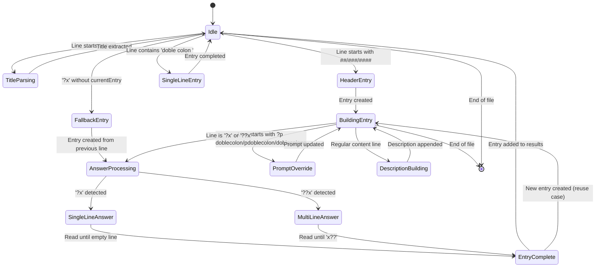
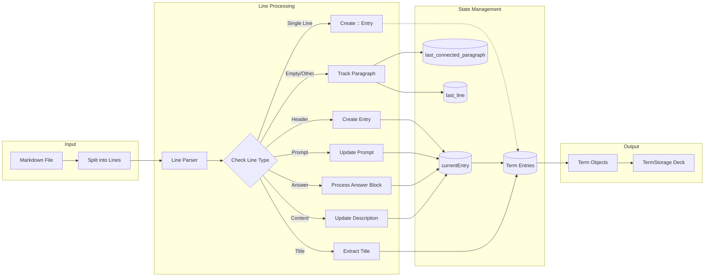
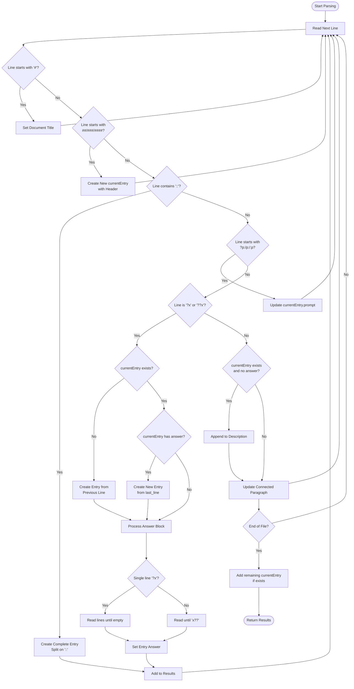

# Markdown Terms Parser State Logic

This document explains the state machine and parsing logic used in `md_terms_parser.js` for processing markdown files into flashcard terms.

## Overview

The parser implements a stateful line-by-line processor that transforms markdown content into structured term objects. It maintains several state variables to track parsing context and build entries incrementally.

## State Variables

The parser maintains the following key state variables:

- `currentEntry`: The term entry currently being built
- `last_connected_paragraph`: Accumulated text from consecutive non-empty lines
- `last_line`: The previous line processed (used for fallback entry creation)
- `last_connected_paragraph_line`: Line number where the current paragraph started
- `i`: Current line index in the parsing loop

## Parser State Machine

## State Transitions

### 1. Title Detection State
- **Trigger**: Line starts with `# `
- **Action**: Extract title and continue parsing
- **Next State**: Continue line-by-line processing

### 2. Header Entry Creation State
- **Trigger**: Line starts with `####`, `###`, or `##`
- **Action**: 
  - Create new `currentEntry` with header text
  - Set initial values (description='', answer='', prompt=header)
  - Record reference line number
  - Headers of `####` level are considered titles will be super considered as potential for decks, and will enable more space for the description. (only resetting after either 2 empty lines or finishing the card or overwriting with a new header)

- **Next State**: Wait for content or answer blocks

### 3. Single-Line Entry State
- **Trigger**: Line contains `::`
- **Action**:
  - Split on `::` to get term and answer
  - Create complete entry immediately
  - Add to results without setting `currentEntry`
- **Next State**: Continue parsing independently
- It will also retrieve the latest description from `:d` that is resetted if any empty line is encountered.

### 4. Inline Entry Creation State  
- **Trigger**: Line starts with `?x` but no `currentEntry` exists
- **Action**:
  - Use previous line as header/prompt
  - Use `last_connected_paragraph` as description
  - Create new `currentEntry`
- **Next State**: Process answer block

### 5. Prompt Override State
- **Trigger**: Line starts with `?p:`, `p:`, or `:p` and `currentEntry` exists
- **Action**: Update `currentEntry.prompt` with specified text
- **Next State**: Continue building current entry

### 6. Answer Block Processing States

#### Single-line Answer (`?x`)
- **Trigger**: Line equals `?x` and `currentEntry` exists
- **Behavior**:
  - If `currentEntry` already has an answer, create new entry using `last_line`
  - Read lines until empty line or end of file
  - Set answer and finalize entry

#### Multi-line Answer (`??x`)
- **Trigger**: Line equals `??x` and `currentEntry` exists  
- **Behavior**:
  - Read lines until closing `x??` marker
  - Set answer and finalize entry

### 7. Description Accumulation State
- **Trigger**: `currentEntry` exists, answer is empty, line doesn't start with `?` or `####`
- **Action**: Append line to `currentEntry.description`
- **Next State**: Continue accumulating or transition to answer block

### 8. Paragraph Connection State
- **Trigger**: Every line processed
- **Behavior**:
  - Empty lines: Reset `last_connected_paragraph`
  - Non-empty lines: Append to `last_connected_paragraph`
- **Purpose**: Maintains context for fallback entry creation

## Entry Completion Logic

Entries are completed and added to results in these scenarios:

1. **Immediate completion**: Single-line `::` entries
2. **Answer block completion**: After processing `?x` or `??x` blocks
3. **End-of-file completion**: Any remaining `currentEntry` at file end

## Special Behaviors

### Answer Re-use Detection
When processing `?x` with an existing answer in `currentEntry`:
- Creates new entry using `last_line` as header
- Uses accumulated paragraph as description  
- Allows multiple Q&A pairs without explicit headers

### Fallback Entry Creation
When `?x` appears without a current entry:
- Uses previous line as the term/prompt
- Uses connected paragraph as description
- Enables flexible markdown structure

### Reference Line Tracking
Each entry records its source line number for debugging and navigation back to the original markdown.

## Data Processing Pipeline

## State Flow Diagram

## Error Handling

The parser is designed to be forgiving:
- Missing components result in empty strings rather than errors
- Malformed entries are still processed with available data  
- State variables are reset appropriately to prevent contamination between entries

This stateful approach allows the parser to handle various markdown formatting styles while maintaining consistency in the output term structure.