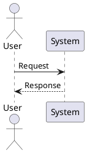

# High-Quality Flashcards: 009---Fundamentals-of-Enterprise-Architecture_processed (Part 21)

**Starting Chapter:** Documentation Standards

---

#### Tangible Direction over Stale Documentation
This principle emphasizes that enterprise architecture must deliver measurable business value, not just abstract documentation. "Tangible direction" means that architectural outputs should have a clear, quantifiable link to business outcomes. Documentation alone is insufficient; it must be tied to business value to be effective.

:p What is the significance of "tangible direction" in enterprise architecture?
??x
Tangible direction refers to architectural outputs that have measurable business value, not just abstract or outdated documentation. It ensures that architecture efforts contribute directly to productivity, cost savings, or risk mitigation, making the work valuable to stakeholders. This transforms documentation from a passive artifact into an active enabler of business goals.
x??

---

#### Common Architectural Views
Several architectural views are commonly used to visualize different aspects of a system. These include layered hierarchy, ontology/interaction, deployment, and sequence views. Each serves a specific purpose, such as showing composability, system relationships, deployment environments, or step-by-step interactions.

:p What are the common architectural views and their purposes?
??x
Common architectural views include:
- Layered hierarchy: Shows composability of capabilities or systems.
- Ontology/interaction: Illustrates how systems relate to one another (e.g., data or network flows).
- Deployment: Visualizes the physical or logical deployment of systems (often using industry icons).
- Sequence: Depicts step-by-step interactions between systems or users.
These views help communicate different aspects of architecture clearly and consistently.
x??

---

#### The Role of Risk Identification in Architecture
Clear documentation allows teams to identify and mitigate risks such as single points of failure or scalability issues. For example, reviewing a deployment architecture can reveal whether horizontal scaling is possible, or whether reliability is at risk due to system dependencies.

:p How does documentation help in identifying architectural risks?
??x
Documentation supports risk identification by allowing reviewers to analyze system designs for issues like single points of failure or scalability limitations. For example, examining a deployment architecture can determine if horizontal scaling is possible, or if the system is vulnerable to reliability risks due to centralized components.
x??

---

#### C4 Model and Diagram Granularity
The C4 model provides a standardized way to create architectural diagrams with consistent levels of detail. It defines how to structure diagrams to avoid clutter and ensure they are intuitive and easy to follow.

:p What is the purpose of the C4 model in architectural diagramming?
??x
The C4 model offers a standardized approach to architectural diagrams with defined levels of granularity. It helps avoid clutter by decomposing complex systems into manageable views, ensuring that diagrams are intuitive and easy to interpret without overwhelming the reader.
x??

---

#### Architecture Strategy vs. Documentation
While documentation is a tool for delivering architecture direction, the strategy itself must be actionable and tied to business outcomes. Strategies often take time to realize, but they can be evaluated through problem sizing and incremental milestones.

:p How does an architecture strategy differ from documentation?
??x
An architecture strategy outlines long-term direction and goals, while documentation is a tool to express and communicate that strategy. Strategies are evaluated by sizing the problems they solve and tracking progress through milestones. Documentation ensures that the strategy is understood and implemented consistently.
x??

---

#### Modeling Languages for Architecture Diagrams
Modeling languages such as UML, PlantUML, ArchiMate, SysML, and BPMN are used to represent architectural designs and system behavior visually. These tools provide standardized notations that allow developers, architects, and stakeholders to communicate complex systems effectively.

:p Which modeling languages are commonly used for architecture diagrams?
??x
Common modeling languages include Unified Modeling Language (UML), PlantUML, ArchiMate, Systems Modeling Language (SysML), and Business Process Model and Notation (BPMN). Each of these languages offers a structured way to model different aspects of a system — such as structure (UML, ArchiMate), behavior (UML, BPMN), or system requirements (SysML). These languages are often used to generate diagrams from code, supporting the "Documentation as Code" approach.
x??

---

#### Code-Based Diagram Generation
Many modeling languages support diagram generation through code, allowing architects to define diagrams programmatically. This approach enables the integration of diagrams into automated build processes and version control, improving maintainability.

:p How does code-based diagram generation improve documentation maintainability?
??x
Code-based diagram generation allows diagrams to be defined in code, making them version-controlled and part of the software development lifecycle. Tools like PlantUML let you write diagrams in text format, which can then be rendered into visual diagrams. This ensures that diagrams evolve alongside code, reducing manual effort and keeping documentation in sync with system changes.
Example:

This code generates a UML sequence diagram, and since it's in code, it can be reviewed, tested, and updated like any other source file.
x??

---

#### Example: Sequence View
A sequence view in architecture modeling shows the interactions between objects or components over time. It is commonly used in UML to depict how different parts of a system communicate.

:p What does a sequence view represent in architecture modeling?
??x
A sequence view illustrates how objects or components interact over time, typically showing the flow of messages between them. It is useful for understanding the dynamic behavior of a system, such as how a user request is processed through various services. For example, in a UML sequence diagram, lifelines represent actors or components, and arrows represent messages exchanged between them.
$$
\text{Sequence Diagram Example:} \\
\text{User} \rightarrow \text{System}: \text{Login Request} \\
\text{System} \rightarrow \text{Database}: \text{Validate Credentials} \\
\text{Database} \rightarrow \text{System}: \text{Validation Result}
$$
x??

---

#### Example: Deployment View
A deployment view shows how software components are deployed across physical nodes or infrastructure. It is useful for understanding system scalability, fault tolerance, and hardware distribution.

:p What is the purpose of a deployment view?
??x
A deployment view illustrates how software components are distributed across physical or virtual machines, servers, or other infrastructure elements. It helps in planning system deployment, identifying bottlenecks, and understanding how components interact in a real-world environment. For example, a deployment view might show that a web application is deployed on one server, while a database is hosted on another.
$$
\text{Deployment View Example:} \\
\text{Web Server} \rightarrow \text{Application Server} \rightarrow \text{Database Server}
$$
x??

---

#### Living Documentation in Architecture
Living documentation refers to architecture diagrams and documents that are actively maintained and updated in sync with real-world changes in systems. This is crucial in dynamic environments where systems evolve frequently, such as in continuous delivery or agile development practices. Without this, diagrams quickly become outdated, leading to misalignment between the documented architecture and the actual system.

:p What is the main challenge with static architecture diagrams?
??x
The main challenge with static architecture diagrams is that they often become stale and out-of-sync with the actual implementation. As systems evolve, especially in fast-paced environments like weekly releases, maintaining these diagrams manually becomes time-consuming and error-prone. For example, if a sequence diagram describes integration between two systems, any real-life changes should automatically update the diagram. This is where "living documentation" becomes essential—diagrams must be treated as dynamic, evolving artifacts rather than static snapshots.
x??

---

#### Queryable Architecture Diagrams with Rules Engines
Queryable architecture diagrams are those that can be interpreted programmatically, allowing rules engines to analyze dependencies, integration patterns, and system behavior. For example, a dependency diagram can be queried to determine the blast radius of a failing component, or to verify that integration patterns are followed.

:p How can architecture diagrams be made queryable for better insights?
??x
Architecture diagrams can be made queryable by representing them in a structured, machine-readable format (e.g., JSON, XML, or graph databases). A rules engine can then query these diagrams to extract insights such as identifying the impact of a failing dependency or validating if integration patterns are followed. For instance, if a system has a dependency on another system, a query could calculate how many other systems depend on it, thus determining the blast radius.

Example:
$$
\text{Blast Radius} = \text{Number of downstream systems depending on } X
$$

This allows architects to make proactive decisions based on real-time data rather than static documentation.
x??

---

#### Selective Documentation
Selective documentation means choosing what to document based on relevance and value. Not every aspect of a system needs to be documented, especially if it's not critical for decision-making or understanding. This approach helps reduce noise and ensures that documentation remains useful and up-to-date.

:p Why is selective documentation important in architecture?
??x
Selective documentation is important because it prevents information overload and ensures that only the most relevant and impactful architectural decisions are captured. It helps in focusing efforts on what truly matters for future planning and system evolution. For example, instead of documenting every interaction between services, an architect might focus only on critical integration points or high-risk dependencies.

This approach aligns with the principle of "document what you need, not what you have."
x??

---

#### Future-Facing Architecture
Future-facing architecture emphasizes planning for upcoming needs and innovations rather than just documenting what currently exists. It encourages architects to think ahead and make decisions that support scalability, adaptability, and long-term goals.

:p What is the difference between current-state and future-facing architecture?
??x
Current-state architecture focuses on documenting what already exists, which can quickly become outdated. Future-facing architecture, on the other hand, emphasizes planning for future needs, scalability, and innovation. While current-state documentation is important for understanding the present, future-facing architecture ensures that decisions support long-term goals and adaptability.

Example:
$$
\text{Future Value} = \text{Current State} + \text{Planned Innovations}
$$

This mindset ensures that documentation supports both present and future needs.
x??

---

---

#### Tangible Direction in Documentation
Tangible direction in documentation refers to the practice of grounding architectural decisions in both technical facts and clear business value. This ensures that documentation isn't stale or theoretical but instead serves as a living, actionable guide for teams. It emphasizes that architecture should be proactive and strategic, not just descriptive of the current state.

:p What is the main idea behind "tangible direction" in architecture documentation?
??x
Tangible direction means that architectural decisions are tied to real business outcomes and technical feasibility. It avoids abstract or outdated documentation by ensuring that each decision supports a clear, achievable goal. This approach allows for better planning, ownership, and continuous improvement.
x??

---

#### Ambitious Architect vs Archaeological Architect
An ambitious architect focuses on defining a future state based on current understanding, aiming to solve problems and plan for growth. In contrast, an archaeological architect only documents the current state without envisioning improvements or addressing constraints. The former fosters innovation and proactive planning, while the latter leads to stagnant documentation.

:p How does an ambitious architect differ from an archaeological architect?
??x
An ambitious architect looks beyond the current state to define a future system architecture that solves real problems and aligns with business goals. An archaeological architect, however, only documents what currently exists, often leading to outdated or unactionable documentation. The key difference is intent: one drives progress, the other maintains status quo.
x??

---

#### Problem-Solving Through Documentation
Documentation should be used to identify and solve real problems faced by product and engineering teams. This involves working closely with stakeholders to understand challenges, then using that understanding to propose architectural improvements that address those issues directly.

:p Why is problem-solving central to effective architecture documentation?
??x
Problem-solving ensures that documentation is relevant and actionable. By identifying real issues, the architect can propose changes that are not only technically sound but also address pain points experienced by the team. This makes documentation more valuable and increases its adoption.
x??

---

#### Future-State Architecture Definition
Defining a future state involves analyzing the current system, identifying constraints, and proposing improvements that lead toward an aspirational architecture. This includes setting clear goals, evaluating feasibility, and determining which constraints can be addressed.

:p How is a future-state architecture defined in the context of architecture documentation?
??x
A future-state architecture is built upon a thorough understanding of the current system and its limitations. It includes proposing changes, assessing constraints, and selecting actionable modifications that move the system closer to an ideal future. This process helps teams make informed decisions and prioritize efforts effectively.
x??

---

#### Associating Architecture with Business Value
Effective documentation ties architectural decisions to tangible business outcomes. This ensures that every architectural choice contributes to strategic goals such as scalability, performance, or cost reduction.

:p Why is associating architecture with business value important?
??x
Linking architecture to business value makes it easier to justify investments and prioritize initiatives. It ensures that technical decisions support organizational objectives, making documentation more impactful and aligned with company strategy.
x??

---

#### Constraints and Their Evaluation
When defining a future system, it's essential to distinguish between true constraints and those that can be overcome. True constraints are hard limitations, whereas others may be flexible or removable.

:p How are constraints evaluated when planning future architecture?
??x
Constraints are analyzed to determine whether they are immutable (true constraints) or potentially removable. Teams must debate and evaluate each constraint to decide which ones to lift or work around, allowing them to create a realistic yet ambitious roadmap for change.
x??

---

#### Driving Behavior over Enforcing Standards
This principle emphasizes that while enforcing standards is necessary, especially in regulated environments, defining and driving desired human behavior is more impactful for achieving enterprise architecture goals. Compliance quality depends heavily on how well people adopt and apply standards in practice. The concept distinguishes between minimum and optimum levels of compliance, where the latter leads to better business outcomes.

:p What is the difference between minimum and optimum compliance levels?
??x
Minimum compliance means meeting only the baseline requirement, such as using a standard programming language. Optimum compliance involves going beyond the minimum by applying best practices like using the correct version, managing memory efficiently, and leveraging secure libraries. For example, in software development, minimum compliance might be writing code in Java, while optimum compliance includes using the latest Java version, following memory management best practices, and using well-known, vulnerability-free libraries.
```java
// Example: Minimum vs Optimum Compliance in Code
// Minimum: Just using a language
public class MinimumExample {
    public void process() {
        // Basic Java usage without optimization
    }
}

// Optimum: Using best practices
public class OptimumExample {
    public void process() {
        // Using latest version, optimized memory handling, secure libraries
        String data = fetchDataUsingSecureLibrary();
        processDataWithMemoryOptimization(data);
    }
}
x??

---

#### Role of Standards in Enterprise Architecture
Standards form the foundation of enterprise architecture. They provide consistency, reduce complexity, and ensure alignment across systems. However, enforcement alone is not enough; standards must be designed with behavioral change in mind to be truly effective.

:p Why are standards important in enterprise architecture?
??x
Standards provide consistency and reduce complexity by ensuring that systems and processes follow common practices. They help align teams, improve interoperability, and reduce risks. However, standards are only effective if people adopt them properly. Therefore, they must be designed with human behavior in mind, focusing not just on enforcement but also on encouraging optimal usage.
x??

---

#### Future-State Architecture and Compliance
A business-beneficial future state in enterprise architecture is secure and compliant. Documentation and standards must support this goal by guiding teams toward optimal behavior and ensuring that compliance efforts contribute to long-term success.

:p How does compliance contribute to a business-beneficial future state?
??x
Compliance ensures that systems and processes meet regulatory and security requirements, which are essential for long-term success. A compliant future state is secure, maintainable, and aligned with business objectives. For example, ensuring that all software is developed using secure, up-to-date libraries helps protect against vulnerabilities and ensures compliance with industry standards.
x??

---

#### Driving Behavior Over Enforcing Standards
This concept emphasizes that architecture governance should focus on shaping human behavior to align with desired outcomes, rather than simply enforcing rigid rules. It's about understanding what good looks like in terms of compliance and identifying barriers to achieving that good behavior.

:p What is the core idea behind "driving behavior over enforcing standards"?
??x
The core idea is that effective architecture governance should encourage desired human behaviors that support business goals, rather than merely enforcing compliance through strict rules. This approach recognizes that people are more likely to follow standards when they understand the intent behind them and see how their actions contribute to positive outcomes. For example, instead of just banning expensive instance types, a system could provide cost projections and incentives that make cost-conscious decisions easier and more natural.
x??

---

